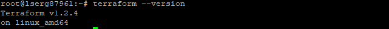
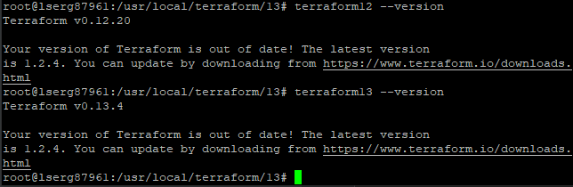

# devops-netology_7.1
1. 
- Какой тип инфраструктуры будем использовать для этого проекта: изменяемый или не изменяемый? - изменяемый, т.к. нет полностью сформированного технического задания, а также с учетом планируемых частых изменений;
- Будет ли центральный сервер для управления инфраструктурой? - нет, управление с любого сервера;
- Будут ли агенты на серверах? - нет;
- Будут ли использованы средства для управления конфигурацией или инициализации ресурсов? - да, Ansible.
- Какие инструменты из уже используемых вы хотели бы использовать для нового проекта? - Terraform, Ansible, Packer, Docker.

2. 

3. 

